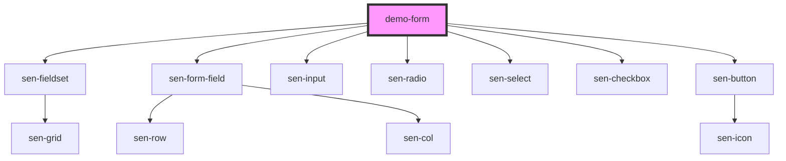

# demo-form

<!-- Auto Generated Below -->

## Dependencies

### Depends on

- [sen-fieldset](../../fieldset)
- [sen-form-field](../../form-field)
- [sen-input](../../input)
- [sen-radio](../../radio)
- [sen-select](../../select)
- [sen-checkbox](../../checkbox)
- [sen-button](../../button)

### Graph

----------------------------------------------

*Built with [StencilJS](https://stenciljs.com/)*
