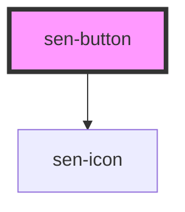

# sen-button

<!-- Auto Generated Below -->


## Usage

### Examples

```html
<sen-button>Default</sen-button>

<sen-button color="primary">Primary</sen-button>

<sen-button color="primary" disabled>Primary</sen-button>
```


## Properties

| Property     | Attribute     | Description         | Type                                                                          | Default     |
| ------------ | ------------- | ------------------- | ----------------------------------------------------------------------------- | ----------- |
| `buttonType` | `button-type` | Button type         | `"button" \| "reset" \| "submit"`                                             | `"button"`  |
| `color`      | `color`       | Button variant      | `"danger" \| "primary" \| "secondary" \| "success" \| "warning" \| undefined` | `undefined` |
| `disabled`   | `disabled`    | Disables the button | `boolean`                                                                     | `false`     |
| `icon`       | `icon`        | Icon to show        | `string \| undefined`                                                         | `undefined` |


## CSS Custom Properties

| Name                    | Description                                                |
| ----------------------- | ---------------------------------------------------------- |
| `--border-left-radius`  | Border radius of left bottom and top edge - default `3px`  |
| `--border-right-radius` | Border radius of right bottom and top edge - default `3px` |


## Dependencies

### Depends on

- [sen-icon](../icon)

### Graph


----------------------------------------------

*Built with [StencilJS](https://stenciljs.com/)*
