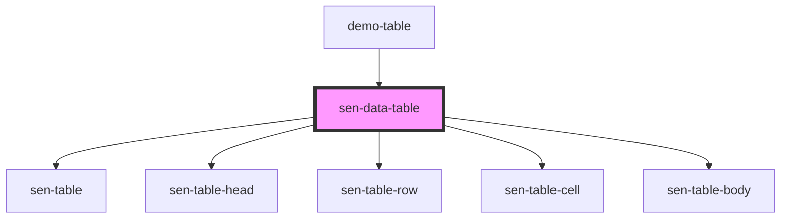

# sen-table

<!-- Auto Generated Below -->

## Properties

| Property  | Attribute | Description                     | Type            | Default |
| --------- | --------- | ------------------------------- | --------------- | ------- |
| `data`    | --        | Table data, array of table rows | `any[]`         | `[]`    |
| `headers` | --        | Table headers                   | `TableHeader[]` | `[]`    |

## Dependencies

### Used by

 - [demo-table](../_demo/demo-table)

### Depends on

- [sen-table](../table)
- [sen-table-head](../table-head)
- [sen-table-row](../table-row)
- [sen-table-cell](../table-cell)
- [sen-table-body](../table-body)

### Graph

----------------------------------------------

*Built with [StencilJS](https://stenciljs.com/)*
