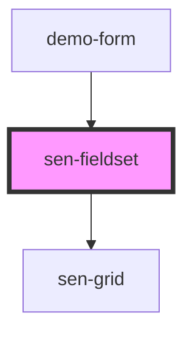

# sen-fieldset

<!-- Auto Generated Below -->

## Properties

| Property | Attribute | Description                    | Type                  | Default     |
| -------- | --------- | ------------------------------ | --------------------- | ----------- |
| `legend` | `legend`  | Legend describing the fieldset | `string \| undefined` | `undefined` |

## Dependencies

### Used by

 - [demo-form](../_demo/demo-form)

### Depends on

- [sen-grid](../grid)

### Graph

----------------------------------------------

*Built with [StencilJS](https://stenciljs.com/)*
