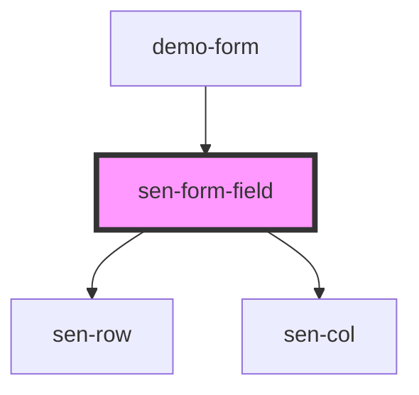

# sen-col

<!-- Auto Generated Below -->


## Usage

### Example

```html
<form>
  <sen-fieldset legend="Contact Information">
    <sen-form-field label="First name">
      <sen-input type="text"></sen-input>
    </sen-form-field>
    <sen-form-field label="Last name">
      <sen-input type="text"></sen-input>
    </sen-form-field>
    <sen-form-field label="Email">
      <sen-input type="text"></sen-input>
    </sen-form-field>
    <sen-form-field label="Gender">
      <label>
        <sen-input type="radio" name="radio" value="Female"></sen-input>Female
      </label><br>
      <label>
        <sen-input type="radio" name="radio" value="Male"></sen-input>Male
      </label><br>
      <label>
        <sen-input type="radio" name="radio" value="Other"></sen-input>Other
      </label>
    </sen-form-field>
    <sen-form-field label="IP">
      <sen-input type="text" disabled value="127.0.0.1"></sen-input>
    </sen-form-field>
    <sen-form-field>
      <sen-button type="submit">Submit</sen-button>
      <sen-button color="secondary" type="button">Abort</sen-button>
    </sen-form-field>
  </sen-fieldset>
</form>
```


## Properties

| Property | Attribute | Description             | Type     | Default |
| -------- | --------- | ----------------------- | -------- | ------- |
| `label`  | `label`   | Label of the form field | `string` | `""`    |


## Dependencies

### Used by

 - [demo-form](../_demo/demo-form)

### Depends on

- [sen-row](../row)
- [sen-col](../col)

### Graph


----------------------------------------------

*Built with [StencilJS](https://stenciljs.com/)*
