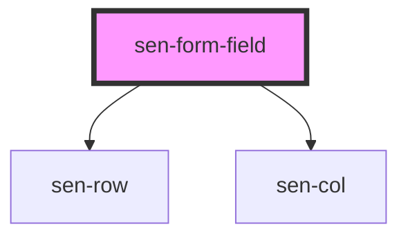

# sen-col

<!-- Auto Generated Below -->

## Properties

| Property | Attribute | Description             | Type     | Default |
| -------- | --------- | ----------------------- | -------- | ------- |
| `label`  | `label`   | Label of the form field | `string` | `""`    |

## Dependencies

### Depends on

- [sen-row](../row)
- [sen-col](../col)

### Graph

----------------------------------------------

*Built with [StencilJS](https://stenciljs.com/)*
