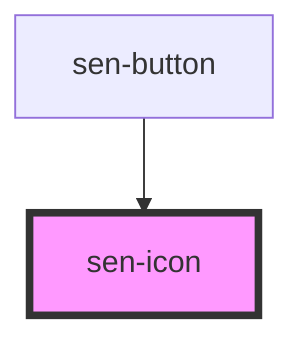

# sen-typeahead

<!-- Auto Generated Below -->


## Usage

### Examples

## Simple usage

```html
<sen-app>
<p>
  <sen-icon name="trash"></sen-icon>
</p>
<p>
  <sen-icon name="add_shopping_cart"></sen-icon>
  Senna icons align nicely with inline text
  <sen-button icon="edit">
    Edit
  </sen-button>
</p>
</sen-app>
```

Senna uses Material icons: https://material.io/resources/icons/?icon=announcement&style=baseline


## Properties

| Property   | Attribute  | Description                                                                                                                                                                                   | Type                  | Default     |
| ---------- | ---------- | --------------------------------------------------------------------------------------------------------------------------------------------------------------------------------------------- | --------------------- | ----------- |
| `color`    | `color`    | The color to use for the background of the icon.                                                                                                                                              | `string \| undefined` | `undefined` |
| `name`     | `name`     | Icon to display.                                                                                                                                                                              | `string`              | `""`        |
| `sanitize` | `sanitize` | When set to `false`, SVG content that is HTTP fetched will not be checked if the response SVG content has any `<script>` elements, or any attributes that start with `on`, such as `onclick`. | `boolean`             | `true`      |


## Dependencies

### Used by

 - [sen-button](../button)

### Graph


----------------------------------------------

*Built with [StencilJS](https://stenciljs.com/)*
