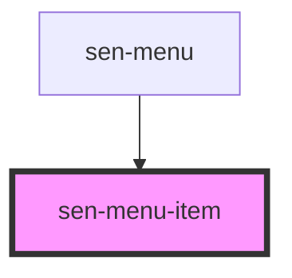

# sen-menu-item

<!-- Auto Generated Below -->

## Properties

| Property | Attribute | Description                | Type      | Default     |
| -------- | --------- | -------------------------- | --------- | ----------- |
| `active` | `active`  | Active state               | `boolean` | `false`     |
| `value`  | `value`   | Value to emit when clicked | `any`     | `undefined` |

## Events

| Event      | Description                             | Type               |
| ---------- | --------------------------------------- | ------------------ |
| `senInput` | Emitted when a keyboard input occurred. | `CustomEvent<any>` |

## Dependencies

### Used by

 - [sen-menu](../menu)

### Graph

----------------------------------------------

*Built with [StencilJS](https://stenciljs.com/)*
