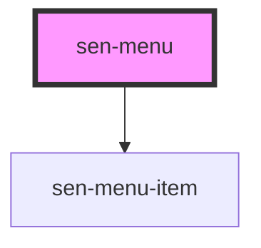

# sen-table

<!-- Auto Generated Below -->

## Properties

| Property | Attribute | Description | Type         | Default |
| -------- | --------- | ----------- | ------------ | ------- |
| `items`  | --        | Menu items  | `MenuItem[]` | `[]`    |

## Dependencies

### Depends on

- [sen-menu-item](../menu-item)

### Graph

----------------------------------------------

*Built with [StencilJS](https://stenciljs.com/)*
