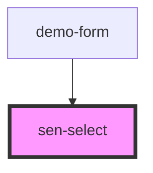

# sen-checkbox


<!-- Auto Generated Below -->


## Usage

### React

```tsx
import React from "react";
import { SenSelect } from "@senna/react";

export const Example: React.FC = () => {

  const options = [
    {value: 1, label: "Option 1"},
    {value: 2, label: "Option 2"},
    {value: 3, label: "Option 3"},
  ]

  return <SenSelect options={options} />
}
```


## Properties

| Property     | Attribute     | Description                                                     | Type                                    | Default         |
| ------------ | ------------- | --------------------------------------------------------------- | --------------------------------------- | --------------- |
| `disabled`   | `disabled`    | If `true`, the user cannot interact with the select.            | `boolean`                               | `false`         |
| `emptyLabel` | `empty-label` | Label of empty option                                           | `string`                                | `"-"`           |
| `label`      | `label`       | Label for the select                                            | `string`                                | `""`            |
| `name`       | `name`        | The name of the control, which is submitted with the form data. | `string`                                | `this.selectId` |
| `options`    | --            | Select options to display                                       | `SelectOption[]`                        | `[]`            |
| `readonly`   | `readonly`    | If `true`, the user cannot modify the value.                    | `boolean`                               | `false`         |
| `required`   | `required`    | Set to true to disallow empty selections                        | `boolean`                               | `false`         |
| `value`      | `value`       | The value of the input.                                         | `null \| number \| string \| undefined` | `undefined`     |


## Events

| Event       | Description                             | Type                                  |
| ----------- | --------------------------------------- | ------------------------------------- |
| `senChange` | Emitted when input is changed           | `CustomEvent<{ value: RadioValue; }>` |
| `senInput`  | Emitted when a keyboard input occurred. | `CustomEvent<MouseEvent>`             |


## Methods

### `setFocus() => Promise<void>`

Sets focus on the specified input. Use this method instead of the global
`input.focus()`.

#### Returns

Type: `Promise<void>`


## Dependencies

### Used by

 - [demo-form](../_demo/demo-form)

### Graph


----------------------------------------------

*Built with [StencilJS](https://stenciljs.com/)*
