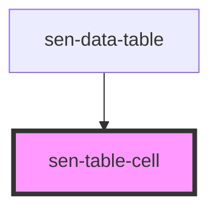

# sen-table-cell

<!-- Auto Generated Below -->

## Properties

| Property  | Attribute | Description              | Type                                         | Default     |
| --------- | --------- | ------------------------ | -------------------------------------------- | ----------- |
| `align`   | `align`   | Alignment of contents    | `"center" \| "left" \| "right" \| undefined` | `undefined` |
| `colspan` | `colspan` | How many columns to span | `number \| string \| undefined`              | `undefined` |
| `rowspan` | `rowspan` | How many rows to span    | `number \| string \| undefined`              | `undefined` |

## Dependencies

### Used by

 - [sen-data-table](../data-table)

### Graph

----------------------------------------------

*Built with [StencilJS](https://stenciljs.com/)*
