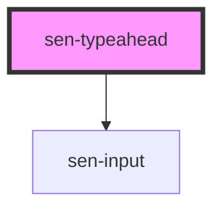

# sen-typeahead

<!-- Auto Generated Below -->

## Properties

| Property  | Attribute | Description                     | Type                | Default |
| --------- | --------- | ------------------------------- | ------------------- | ------- |
| `options` | --        | Options to display in typeahead | `TypeaheadOption[]` | `[]`    |
| `value`   | `value`   | The value of the input.         | `string`            | `""`    |

## Events

| Event       | Description                             | Type                               |
| ----------- | --------------------------------------- | ---------------------------------- |
| `senChange` | Emitted when input is changed           | `CustomEvent<OptionSelectedEvent>` |
| `senInput`  | Emitted when a keyboard input occurred. | `CustomEvent<KeyboardEvent>`       |

## Dependencies

### Depends on

- [sen-input](../input)

### Graph

----------------------------------------------

*Built with [StencilJS](https://stenciljs.com/)*
